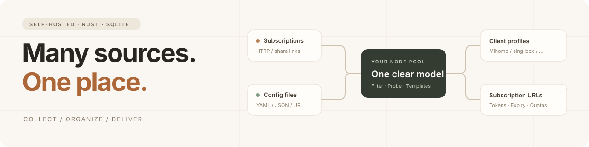
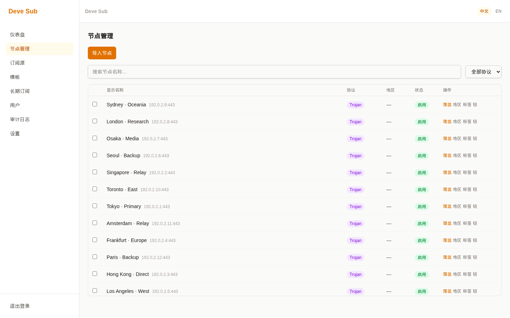
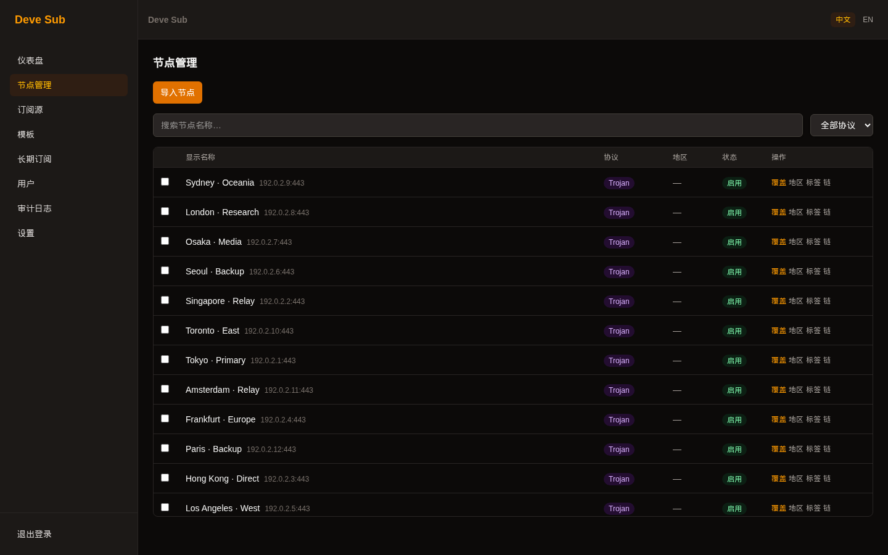

<h1 align="center">Deve Sub</h1>

<p align="center"><strong>把分散的节点，整理成自己的长期订阅。</strong></p>

<p align="center">
  <a href="https://github.com/Develata/deve-sub/releases/latest"></a>
  <a href="https://github.com/Develata/deve-sub/actions/workflows/ci.yml"></a>
  <a href="LICENSE"></a>
  
</p>

<p align="center">
  <a href="#quick-start">开始部署</a> ·
  <a href="#features">功能一览</a> ·
  <a href="#formats">格式与兼容性</a> ·
  <a href="docs/README.md">项目文档</a> ·
  <a href="https://github.com/Develata/deve-sub/issues">反馈问题</a>
</p>



Deve Sub 是一个用 **Rust** 构建的自托管代理订阅管理平台。导入机场订阅、分享链接或配置文件，
在统一节点池中整理、检测和编排，再为不同设备生成长期订阅 URL。

一个服务、一份 SQLite 数据库，配合 Web 管理界面和 CLI。你掌握订阅源、模板、用户权限与数据，
客户端只需保留自己的订阅地址。

> 本页描述当前 `main`；下载包的能力以对应 release tag 为准。项目已进入部署验收阶段，
> 已执行证据与未完成项目见[验收矩阵](docs/acceptance/matrix.tsv)，不以功能列表代替生产验收。

<a id="preview"></a>

## 界面预览



<p align="center"><sub>真实应用截图 · 本地虚构演示数据 · 节点地址使用保留地址段</sub></p>

<details>
<summary>查看深色主题</summary>



</details>

<a id="features"></a>

## 从导入到分发，留在同一个工作流里

|  | 能做什么 |
| :--- | :--- |
| **01 · 收集** | 管理 HTTP 订阅源，粘贴分享链接或导入配置文件；定时刷新、ETag/304，失败时保留上一次有效快照。 |
| **02 · 整理** | 统一节点池、去重、标签、地区、人工 override、批量启停；10k 逻辑节点采用虚拟列表，限制实际 DOM 数量。 |
| **03 · 检测** | TCP connect、适用协议的 QUIC handshake、通过外部代理核心进行真实代理检测；支持批量取消和链式代理环检测。 |
| **04 · 编排** | V3 模板、动态选择或固定快照、代理组与规则、版本历史及回滚；生成前检查目标兼容性。 |
| **05 · 分发** | 多客户端配置、长期 Token URL、Token 轮换、ETag 缓存、用户到期与流量配额控制。 |
| **06 · 管理** | 管理员与普通用户权限、TOTP 两步验证及恢复码、审计日志、备份恢复、Web 与 CLI 双入口。 |

界面支持中英文、亮色与深色模式、Minimal Warm / Fantasy Violet 主题、自定义强调色与品牌名称，
并提供移动端布局、键盘导航和减少动画选项。

**流量统计有明确来源。** Nezha、DStatus、Komari、上游订阅响应头或人工输入提供流量观测；
订阅下载次数不会被当作真实代理流量。额度超限控制的是订阅分发，不会撤回客户端已经获取的节点配置。

<a id="quick-start"></a>

## 开始部署

### Linux · binary + Web + systemd

适用于带 systemd 的 Linux `amd64` / `arm64`。需要 `curl`、`tar`、`sha256sum`、`timeout`、`flock`
及管理员权限。安装器会配置服务账户、数据目录、匹配的 Web 文件和 systemd 服务。

```bash
# 下载并审阅当前安装器；固定 release 版本，避免两次安装使用不同产物。
curl -fsSL --connect-timeout 15 --max-time 60 \
  https://raw.githubusercontent.com/Develata/deve-sub/main/scripts/install.sh \
  -o install-deve-sub.sh

# 先仅监听本机，完成初始化后再配置正式访问入口。
sudo env DEVE_SUB_VERSION=v0.1.0 DEVE_SUB_BIND=127.0.0.1:8080 \
  sh install-deve-sub.sh
```

打开 **http://127.0.0.1:8080**，按引导创建首个管理员。远程服务器可先通过 SSH 隧道访问：

```bash
ssh -L 8080:127.0.0.1:8080 user@your-server
```

安装器校验下载文件的 checksum，bootstrap 信任来自 HTTPS；这不等同于验证发布者签名。
对外提供服务前配置 HTTPS 反向代理、Secure Cookie 和可信代理边界。完整行为见[部署与更新](docs/features/deployment.md)。

<details>
<summary><strong>Docker Compose · 从固定版本源码构建</strong></summary>

需要 Docker 和 Compose 插件。首次运行会编译 Rust binary 与 Web，耗时长于下载预编译产物。

```bash
git clone --branch v0.1.0 --depth 1 https://github.com/Develata/deve-sub.git
cd deve-sub
docker compose up -d --build
docker compose logs -f deve-sub
```

[仓库 Compose](docker-compose.yml) 使用 named volume 保存 `/app/data`，入口会迁移数据库后启动服务。
默认映射宿主机 `8080` 端口；只供本机访问时，把 `ports` 改成 `127.0.0.1:8080:8080`。
停止容器可用 `docker compose down`；不要为普通升级附加 `--volumes`，它会删除持久化数据卷。

</details>

### 第一次使用

1. **添加节点**：创建订阅源并刷新，或在节点管理中粘贴分享链接。
2. **整理节点池**：按协议、地区和标签筛选，按需检测连接或设置 override。
3. **准备模板**：选择输出目标，配置节点选择、代理组和规则，检查兼容性报告。
4. **创建长期订阅**：绑定模板，设置到期和额度，把对应订阅 URL 导入客户端。

<a id="formats"></a>

## 格式与兼容性

| 层次 | 当前覆盖 |
| :--- | :--- |
| **输入容器** | 单行 URI、Base64 subscription、Mihomo YAML、sing-box JSON、Xray / V2Ray JSON、Shadowrocket 分享列表 |
| **核心协议** | VLESS / Reality、VMess、Trojan、Shadowsocks、Hysteria2、TUIC v5、NaiveProxy |
| **扩展支持** | WireGuard、AnyTLS、Snell、ShadowTLS；xhttp 属于 transport，不是独立协议 |
| **输出与客户端** | Mihomo / FlClash、sing-box、Xray、v2rayN / v2rayNG、Shadowrocket、URI 列表、JSON profile |

**支持范围按目标和协议版本区分。** 解析成功不意味着每个客户端都能使用所有特性。
例如 xhttp 不投影到 sing-box；不兼容项进入报告，strict mode 可阻止不符合要求的生成，
不会为凑齐输出而静默关闭 TLS 证书验证。语义与限制见[术语定义](docs/plan/01-terminology.md)
和[协议验收用例](tests/acceptance/matrix.yaml)。

<a id="operations"></a>

## 为持续运行留好恢复路径

### 数据归你管理

原生安装默认布局：

```text
/usr/local/bin/deve-sub                CLI 与服务程序
/usr/local/share/deve-sub/web/         Web 静态文件
/var/lib/deve-sub/
├── deve-sub.db                        SQLite 数据库
└── master.key                         敏感字段加密主密钥
```

订阅 Token 以摘要保存，敏感字段加密存储。**数据库备份不包含主密钥本身**；请单独安全备份
`master.key`，恢复时使用匹配的密钥。在线备份、停止服务后恢复及前向迁移说明见[备份与恢复指南](docs/guides/backup-restore.md)。

### 更新之前，先确认更新的范围

| 路径 | 更新范围与注意事项 |
| :--- | :--- |
| **原生安装器** | 同时安装 binary 和匹配 Web；失败时尝试恢复旧文件与服务。现有数据库需要 schema 迁移时，先备份、再显式迁移。 |
| **`deve-sub update`** | 仅更新 binary，默认验证 Ed25519 signed manifest。当前 `main` 在 Web 模式下默认拒绝此操作；`--binary-only` 是显式接受版本偏差。 |
| **Docker** | 替换完整版本镜像，保留数据卷；入口会执行数据库迁移，升级前同样需要备份。 |

`main` 的 `--force` 仅允许同版本重装，降级另需 `--allow-downgrade`。这些参数不关闭签名验证。
原生安装器的多文件替换**不是掉电原子事务**；如果出现 pending checkpoint，应按
[部署说明](docs/features/deployment.md)检查并恢复，保留回滚所需材料。
安装旧 release 时不要假定它已经包含 `main` 的更新防护。

<a id="engineering"></a>

## 简单部署，明确边界

**Rust · Axum · SQLite · Dioxus / WASM**

业务处理集中在服务端。Web 是操作入口，REST API 和 CLI 共享应用能力；
模块化单体通过内部边界分工，无需为日常部署引入 Redis、消息队列或外部数据库。
真实代理检测按需调用单独安装的代理核心。

<details>
<summary><strong>构建、验证与当前证据</strong></summary>

使用 [rust-toolchain.toml](rust-toolchain.toml) 固定的工具链构建 binary：

```bash
cargo build --locked --release --bin deve-sub
./target/release/deve-sub --help
```

Web 还需要 WASM target 与 Dioxus CLI；运行 Playwright 浏览器测试另需 Node.js：

```bash
rustup target add wasm32-unknown-unknown
cargo install dioxus-cli --locked --version 0.7.10
bash scripts/build-web-release.sh
```

只构建 binary 不会内嵌 Web。启动时用 `--web-dist-dir` 指向构建产物，或使用 `--headless`。
首次启动前需初始化主密钥并迁移数据库，分别查看 `deve-sub key --help` 与 `deve-sub migrate --help`。

当前 CI 包含 Rust 检查、兼容性验证、架构与文档守卫、真实进程 soak、浏览器与容器测试。
此外已有 disposable Debian/systemd VM 的安装、reboot、升级与故障恢复记录，
以及 30 分钟真实进程资源测量。短期通过不等于长期无泄漏，VM installer 验收也不等于 signed updater 验收。

- [验收方法与实际边界](docs/acceptance/gates.md)
- [逐项验收状态](docs/acceptance/matrix.tsv)
- [CI 工作流](.github/workflows/ci.yml)
- [构建 Web 的统一入口](scripts/build-web-release.sh)

</details>

<a id="docs"></a>

## 文档与贡献

| 我想…… | 从这里开始 |
| :--- | :--- |
| 安装、更新或处理失败 | [部署与更新](docs/features/deployment.md) |
| 备份或迁移数据 | [备份与恢复](docs/guides/backup-restore.md) |
| 接入 API | [生成的 OpenAPI](docs/openapi/openapi.json) |
| 了解发布包和验证方式 | [Release artifact contract](docs/contracts/release-artifacts.md) |
| 理解架构与参与开发 | [文档导航](docs/README.md) · [贡献指南](docs/guides/contributing.md) |

欢迎提供带版本、复现步骤和预期行为的 [Issue](https://github.com/Develata/deve-sub/issues)。
提交日志、截图和配置时请移除真实订阅 URL、Token、节点凭据与私钥。

---

<p align="center">Made with Rust · Self-hosted by you<br><a href="LICENSE">MIT License</a> · © 2026 Develata</p>
