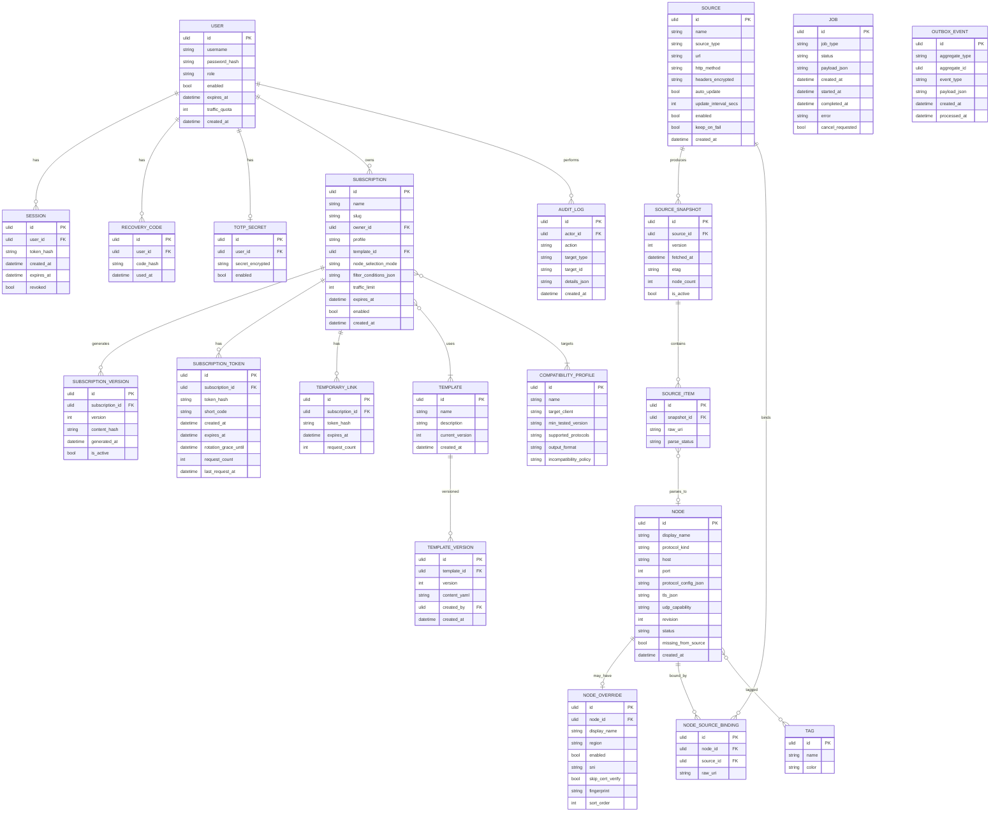

# Core Entity-Relationship Model

## Scope

This document defines the conceptual entity model for Deve Sub. The physical
schema source of truth is the `migrations/` directory. This diagram is the
conceptual guide; when they disagree, migrations prevail and this diagram must
be updated.

## Core ER diagram

The diagram covers the core entities required by the product spine. Not all
planned entities appear here; see `entity-catalog.md` for the full registry.

## Notes

- `NODE.chains_to` is a self-referential relationship (chain proxy targeting
  another node or group). It is omitted from the diagram to avoid rendering
  issues; see `docs/plan/05-protocol-engine.md` §"Override" and the spec §9.3.
- `JOB` is a standalone entity; jobs are created by application commands and
  tracked independently. Job types include source refresh, node test,
  subscription generation, and probe sync.
- `AUDIT_LOG` and `OUTBOX_EVENT` are infrastructure entities that do not
  participate in business relationships but are persisted alongside domain
  state.
- Encrypted fields (headers, cookies, TOTP secrets) are stored as ciphertext;
  the master key comes from a file or secret mount, never from the database.
- Token fields (`token_hash`) store HMAC-SHA256 digests, never plaintext tokens.
