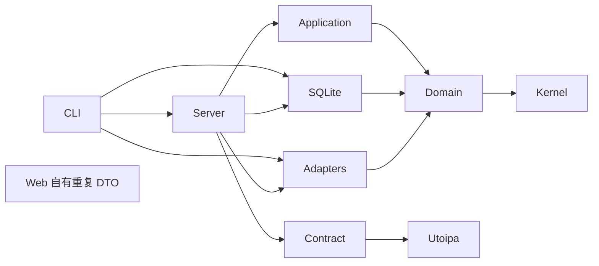
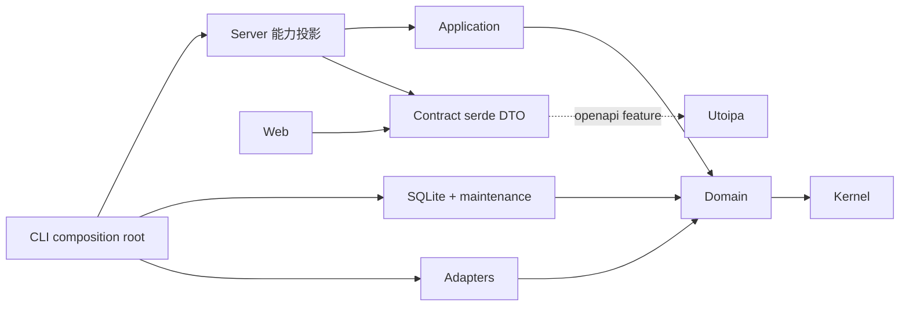

# Deve Sub 工程优化与加固报告

日期：2026-09-09。基线：`f78d77d0eea7b9fef00f8d167a851457be500374`。
本报告记录一次实现与验证结果，不替代 `docs/plan/`、contracts 或迁移文件。
负责人：主代理；独立复查：runtime/security 与 storage 两条审查线，均已关闭阻断项。
范围：M2/M4/M7/M8/M10/M11 的运行资源、边界、持久化、性能与交付验证。
非目标：发布、推送、生产密钥配置、重写业务模型、引入框架或优化所有历史大文件。

## Executive Summary

完成了有证据支持的资源闭环、流量事务投影、SQLite 查询优化、API 能力收窄、共享 DTO、网络取消与供应链加固。
发现并修复了严重安全与数据一致性问题：认证代理连接忽略证书验证语义、探针流量计数先推进后写入、旧备份在迁移后被错误拒绝。
另修复真实 Web 发布包未包含 CSS 的交付缺陷。

没有引入新缓存框架、事件溯源、微服务、锁自由结构、定制分配器或 unsafe。
系统具备更明确的长期运行边界，但本次十分钟量级试验不能证明多年无故障；生产签名密钥、无人值守升级与真实部署仍需运维验收。

## Confirmed Findings

状态针对原始 HEAD；“部分确认”表示存在问题但原建议或范围不完全成立。

| Finding | Status | Root cause | Fix | Tests / Measured effect |
|---|---|---|---|---|
| A1 登录限流无硬上限 | confirmed | 清除过期项后仍插入新键；用户名/IP 共用命名空间 | SHA-256 固定键、独立命名空间、10,000 硬上限；满载拒绝新键，不驱逐有效封禁 | 100k 对抗键、到期、正常限流、命名空间测试；容量不越界 |
| A2 JoinSet 历史任务累积 | confirmed | 仅退出时消费完成任务，关闭与提交未互斥 | spawn 时及每分钟 reap；64 容量；关闭互斥；panic/cancel 计数；有界 drain/abort | 10k 短任务、panic、拒绝、取消、关闭；完成历史不永久保留 |
| A3 生产 WAL 无显式维护 | confirmed | 依赖 SQLite 默认 auto-checkpoint；试验结论未落到 serve | SQLite adapter 提供 PASSIVE；每 60 秒及退出采样；超时与未完成告警 | pinned-reader / 释放读者后回填 / 重复写入测试；不承诺绝对文件上限 |
| A4 PERF-006 不是真实 soak | confirmed | mock HTTP 只覆盖 reqwest | 真实进程、临时 DB、API 工作流、/proc 与日志采样；CI 90 秒，本地默认 30 分钟 | 本次执行 90 秒前后对照与 600 秒改后试验，数据见下 |
| B1 AppState 权限过宽 | confirmed | 所有路由可获得全部 ports/config | 11 个 FromRef 能力投影；认证提取器按能力约束 | API 全套与架构守卫；无额外网络层 |
| B2 server 依赖具体设施 | confirmed | composition 已在 CLI，但 Cargo 仍暴露 adapters/storage | 两项移到 dev-dependencies | Cargo metadata 与 guard；生产 DAG 不再有这些边 |
| B3 Web DTO 漂移 | confirmed | 手写重复结构；OpenAPI 依赖无条件启用 | contract 默认 serde DTO，openapi 可选；Web 复用 DTO，保留 UI 状态与展示函数 | 原生/OpenAPI/WASM 编译及真实浏览器；大小见下 |
| B4 DB 编码泄漏 | confirmed | Domain/Application 使用一字符持久化表示 | 7 个枚举编码集中到 SQLite 私有 trait；应用排序用业务枚举 | 旧数据升级/仓储测试；数据库字节表示未改变 |
| C1 原始流量永久增长、终身 SUM | confirmed | raw 是当前总量与每日图的共同来源 | 插入事务维护 totals/probe totals/daily；raw 保留 30 天、daily 400 天 | 升级、重复、溢出、回滚、备份恢复；当前每订阅读取最多 3 类汇总 |
| C2 其他历史无限增长 | partially confirmed | 部分已有清理，终态与崩溃记录覆盖不全 | 保留既有 snapshot/cache 策略，补 jobs/session/link/outbox 与崩溃终态时间 | 活跃记录保护、过期分页、恢复与升级测试；audit 与用户版本明确长期保留 |
| D1 reconcile 多次逐行查找 | confirmed | 查询未满足旧 partial index 条件；每输入重复查找 | 完整覆盖索引；500 fingerprint 预取；250 条绑定/条目批写；输入内更新查找表 | 实际 EXPLAIN 与 100/1k/10k 事务基准；新节点加密插入仍逐行 |
| D2 generation 需整体优化 | partially confirmed | 旧 benchmark 的批 setup 让“无缓存”实际命中缓存 | 修正每轮清缓存、完整加密 SQLite pipeline；不改已合理的生成算法 | 100/1k/10k 冷热路径；不把测量波动描述为性能改进 |
| D3 parser 复制/异常输入 | partially confirmed | 自动 base64 检测重复解码；部分入口仅限制成功节点 | 复用解码结果；10 MiB 输入/10k 条目，失败条目也计数；提前拒绝容器超限 | 大量坏行、深 JSON、YAML alias、体积/数量边界；未重写解析器 |
| D4 虚拟化“延迟测试”失真 | confirmed | sleep 主导时间阈值，未验证 DOM 边界 | 十次滚动、DOM 数量与末端过滤恢复；借用 DTO 避免每 render 克隆 10k 结构 | 10k 逻辑行、最多 24 数据行、总 DOM <500；记录时间但不作脆弱阈值 |
| E1 probes 模块过大 | confirmed | CRUD、run、latency、映射/错误混合 | 按这些变更原因拆分 server probes；SQLite probe/node repo 同样按职责拆分 | 原集成测试保留；未机械拆所有文件 |
| E2 缺少架构机械约束 | confirmed | 规则只在文档 | 小 Python guard 检查实际生产 DAG、state/编码边界、大小与 action SHA | 15 crates 检查；16 个遗留大文件具理由与不可增长上限 |
| F observability crate 空壳 | obsolete | 它已有实际 subscriber 初始化 | 保留 crate，移除未用依赖；新增资源、checkpoint、retention、reconcile 日志 | soak 消费运行日志；没有新增按用户/URL/节点分标签的指标 |
| G 取消/退出资源漏洞 | confirmed | await 后清登记、VMess detached child、部分 I/O 分段重置超时 | RAII 登记、流持有 child handles、整体 deadline、HTTP drain 与 pool close 限时 | 提交拒绝、超时析构、VMess 1000 次 Drop、HTTP 慢请求与 CLI 子进程回收 |
| H 外部二进制/供应链缺口 | confirmed | CI 仅版本固定、未校验下载内容；action tag 可移动 | 固定 SHA action、validator SHA-256、cargo-deny、锁定工具；修正 SBOM 实际输出路径 | 3 个真实 validator 与依赖审计、SBOM 本地生成；没有执行远端发布 |
| 依赖过量/重复运行栈 | partially confirmed | Shadowsocks 默认 features 引入未用 DNS/cache/watch 栈 | 仅保留 aead-cipher；移除确认未用直接依赖；不强行合并不同主版本 | machete/deny/Cargo graph；大小见下 |
| 文档 pass/not-run 冲突 | confirmed | roadmap、Markdown、TSV、YAML 重复手工维护状态 | YAML 为权威；TSV 生成并比对全部五字段；文档链接权威状态 | docs gate 与篡改字段负向检查；OpenAPI 从代码重新导出 |

## Additional Findings

| 级别 | 发现与处置 |
|---|---|
| P0 | 真实认证代理 TLS 无条件 skip verify，可能泄露认证数据。现按节点显式选择验证；默认/false 使用可信根；不支持的 pins/Reality 在认证前失败关闭。 |
| P1 | 探针同步先更新累计 counter，随后逐条写入，故障永久漏计且并发重复计。revision CAS 与全部流量写入改为同一事务；冲突返回 409。 |
| P1 | 备份校验在升级之后进行，迁移生成 daily 行使旧 manifest 数量不符。改为 staging 中先校验原数据再迁移；完整 CLI 旧备份/清理后备份恢复通过。 |
| P1 | probe body reader 吞流错误/截断后解析部分 JSON；现对成功响应拒绝超限、截断和非 UTF-8。诊断错误体单独有界读取。 |
| P1 | VMess detached 双向转发可在调用者放弃后存活；流对象现在拥有并在 Drop 中 abort 两个任务。 |
| P1 | backup tar 未强制唯一常规文件；对白名单条目拒绝 link、目录和重复项；未知或不安全路径记录告警并跳过。外部版本命令限制 4 KiB/5 秒，systemctl 限时并诚实报告未知运行状态。 |
| P1 | Web 发布引用未复制的 CSS，页面无样式。改为 Dioxus asset 引用，发布脚本和浏览器 computed style 双重验证。 |
| P1，剩余 | 发布验证仍嵌入开发公钥，允许双签名资产均缺失时回退 unsigned checksum。正式发布前必须配置密钥并确定旧版升级策略；未擅自轮换或发布。 |
| P2 | 崩溃探针任务终态缺完成时间，可能绕过 retention；恢复时写入完成时间，旧记录从升级日起保留 30 天诊断窗口。 |
| P2 | 旧 SBOM 命令参数/输出文件路径与锁定工具不一致；用实际成功生成结果修复 workflow。 |
| P2，剩余 | 全局 product name 的部分前端标签/标题仍未完全统一；属于已有 UI 语义债，本次没有扩展成整体品牌重构。 |
| P3，剩余 | 保留 16 个有理由的大文件例外，以及主版本不兼容带来的依赖重复；有机械上限，不以拆文件或强升版本掩盖复杂度。 |

## Architecture Before / After

箭头表示实际 Cargo 生产依赖；省略第三方依赖。完整边集见随附 evidence JSON。

Server 仍可依赖 security 等既有纯能力，测试仍可装配实际 SQLite/adapters；本次没有宣称“整个 Server 只依赖 Application”。
能力投影限制了无关资源的可见性，但并不在类型层面证明所有业务规则归属正确；仍需审查跨仓储行为。

## Runtime Resource Model

| 资源 | 上限 / 生命周期 | 限制与观测 |
|---|---|---|
| 登录限流 | 10,000 resident entries；满载未知键拒绝；压力清理至多每秒一次 | SHA-256 key 固定长度；有效封禁不被新键驱逐；记录 resident 数 |
| JobSupervisor | 64 tracked tasks；提交前和每分钟回收；关闭后拒绝 | 完成、panic、cancel 计数；超时 abort 后最多再等 1 秒析构 |
| cancellation registry | RAII 随 admitted future 存活；取消、失败、拒绝与 never-polled 都清理 | 活跃任务受 64 admission 约束；并发请求登记仅为短暂状态，不是历史累积 |
| HTTP/后台退出 | HTTP drain 30 秒；后台协作取消后有界等待；pool close 有界 | 非协作同步代码不能由 Tokio timeout 抢占；没有声称任意代码均可强杀 |
| 外部 I/O | fetch 总 deadline 含 DNS/重定向/body；panel/GeoIP DNS 5 秒；整批 panel sync 120 秒 | 超时会 drop future；外部 systemd job 不因 systemctl 客户端退出而保证取消 |
| SQLite WAL | auto-checkpoint 1000 页；journal_size_limit 16 MiB；每分钟 PASSIVE + 退出 checkpoint | 16 MiB 不是 pinned reader 下的绝对上限；记录 busy/log/checkpointed 与字节 |
| traffic totals | 每订阅/来源种类至多 3 行；probe attribution 按 distinct prefix 保留，当前生产三类，历史 prefix 没有硬 3 行上限 | 当前总量读取不扫描 lifetime raw；删除订阅由 FK cascade 删除投影；流量 reset 使用显式多表事务 |
| traffic raw / daily | 30 天 / 400 天；插入时原子增量投影 | 时间窗口不是按字节配额；高写入量与实体数量仍影响磁盘 |
| probe / refresh jobs | 终态 30 天；活跃状态保留；崩溃恢复有诊断窗口 | probe 子记录级联；记录清理行数与错误 |
| session / temp link / outbox | 过期 session/link；已处理 outbox 30 天；未处理 outbox 保留 | 未处理 backlog 是业务故障信号，不能为省空间丢弃 |
| source snapshots / generated cache | 每源最近 10 份；每 template/profile active + 8 个 inactive | 既有政策保留；不是全库固定容量 |
| audit / template versions / missing nodes | audit 和用户版本有意长期保留；缺失节点保留身份/引用 | 数据增长是明确保留选择；需要操作者容量规划 |
| retention 执行 | 每表每批最多 500 个父记录；每分钟最多 10 轮、总预算 10 秒 | 级联物理删除可超过 500；过期速度超过清理能力会积压；未自动 VACUUM |

PASSIVE 的读者阻塞与回填语义依据 [SQLite WAL 文档](https://www.sqlite.org/wal.html) 和
[wal_checkpoint pragma](https://www.sqlite.org/pragma.html#pragma_wal_checkpoint)，并由本地 pinned-reader 测试验证。

## Performance Results

环境：Intel i7-12700H、20 logical CPU、WSL2 Linux 6.18.33.2、约 7.8 GiB RAM、Rust/Cargo 1.97.1。
同一机器、同一 release profile、同一 synthetic harness；基线 checkout 只覆盖测量 harness，生产代码保持原 HEAD。测量阶段没有并行编译。
下表为 Criterion **median**，单位毫秒；变化为 `(after / before - 1) × 100%`，负数表示耗时降低。置信区间保存在 [evidence JSON](2026-09-09-engineering-hardening-evidence.json)。

| 路径 | 节点数 | Before ms | After ms | 变化 |
|---|---:|---:|---:|---:|
| reconcile 新增 | 100 | 60.873 | 7.942 | -86.95% |
| reconcile 新增 | 1,000 | 391.739 | 79.086 | -79.81% |
| reconcile 新增 | 10,000 | 17214.551 | 816.063 | -95.26% |
| reconcile 刷新 | 100 | 28.518 | 2.989 | -89.52% |
| reconcile 刷新 | 1,000 | 453.935 | 30.441 | -93.29% |
| reconcile 刷新 | 10,000 | 13308.248 | 824.018 | -93.81% |
| generation 缓存 | 100 | 0.468 | 0.511 | +9.27% |
| generation 缓存 | 1,000 | 0.520 | 0.546 | +4.97% |
| generation 缓存 | 10,000 | 0.914 | 1.015 | +11.01% |
| generation 无缓存 | 100 | 6.667 | 7.337 | +10.05% |
| generation 无缓存 | 1,000 | 65.730 | 69.594 | +5.88% |
| generation 无缓存 | 10,000 | 699.054 | 690.509 | -1.22% |
| Trojan URI parser | 100 | 0.098 | 0.106 | +8.42% |
| Trojan URI parser | 1,000 | 1.142 | 1.201 | +5.17% |
| Trojan URI parser | 10,000 | 11.806 | 12.224 | +3.54% |

10k reconcile 新增/刷新耗时下降 95.26% / 93.81%。从 1k 到 10k，新增约 10.3 倍、刷新约 27.1 倍；刷新仍存在非线性放大，本次未单独 profiling 定位其剩余成本，不能声称所有规模严格线性。没有测量 SQL trace 总条数或 allocations；事务墙钟与 EXPLAIN 是本次证据。

generation 小规模约慢 5–10%，10k 无缓存约持平；parser 约慢 3.5–8.4%。没有声称这些路径优化成功，也没有因这些微小差值引入复杂结构。未做重复 A/B 交替实验来分离机器漂移与新边界检查成本。

| 产物（未压缩） | Before bytes | After bytes | 变化 |
|---|---:|---:|---:|
| 原生 release 二进制 | 24,032,728 | 22,738,448 | -5.39% |
| raw WASM（相同 cargo build 参数） | 3,882,154 | 4,015,228 | +3.42% |

原生减少 5.39%，WASM 增加 3.43%；共享 DTO 的目标是消除漂移，不是承诺体积缩减。raw WASM 不是 wasm-opt 后网络传输体积。

| 资源 / 试验 | 初始 | 峰值 | 最终 | 后半程范围 | 后半程斜率 / cycle |
|---|---:|---:|---:|---:|---:|
| RSS MiB / before 90s | 38.68 | 49.04 | 49.04 | 47.00–49.04 | 1730.548 bytes |
| RSS MiB / after 90s | 38.66 | 45.12 | 45.12 | 44.61–45.12 | 400.636 bytes |
| RSS MiB / after 600s | 38.76 | 49.88 | 49.88 | 49.23–49.88 | 47.431 bytes |
| FD / before 90s | 17.00 | 27.00 | 26.00 | 26.00–27.00 | 0.000 FD |
| FD / after 90s | 16.00 | 23.00 | 22.00 | 22.00–23.00 | -0.000 FD |
| FD / after 600s | 16.00 | 29.00 | 28.00 | 28.00–29.00 | 0.000 FD |
| WAL MiB / before 90s | 0.20 | 4.07 | 4.07 | 3.99–4.07 | 92.677 bytes |
| WAL MiB / after 90s | 0.20 | 4.13 | 4.13 | 4.03–4.13 | 75.802 bytes |
| WAL MiB / after 600s | 0.20 | 4.11 | 4.11 | 4.11–4.11 | 0.000 bytes |
| DB MiB / before 90s | 0.44 | 3.48 | 3.48 | 1.89–3.48 | 1317.939 bytes |
| DB MiB / after 90s | 0.49 | 3.93 | 3.93 | 2.20–3.93 | 1379.520 bytes |
| DB MiB / after 600s | 0.49 | 25.22 | 25.22 | 12.82–25.22 | 1448.478 bytes |

| 试验 | 秒 | cycles | requests | 非预期失败 / ERROR | checkpoint 样本 | sampled tracked peak/final | limiter peak/final |
|---|---:|---:|---:|---:|---:|---:|---:|
| before | 90.027 | 2,406 | 11,321 | 0/0 | 0 | 未提供 | 未提供 |
| after | 90.022 | 2,624 | 12,345 | 0/0 | 3 | 0/0 | 263/263 |
| after long | 600.007 | 17,980 | 84,513 | 0/0 | 12 | 0/0 | 1798/1798 |

after 两次试验的 panic/cancellation 采样均为 0。任务峰值 0 是每分钟维护日志的采样值，短任务在采样前已回收，**不表示从未运行任务**。并发硬上限由 admission 测试验证。

90 秒基线与改后均出现可接受短期资源包络，不能以此证明旧版本发生可见内存泄漏。十分钟改后 RSS 后半程仅约 0.65 MiB 幅度、FD 28–29、WAL 零尾部斜率；限流键仍随新失败登录增加但受 10k 对抗测试证明的硬上限约束。

Soak 使用真实 serve、导入、生成/交付、探针、流量、认证与读取。source refresh 在真实应用中走 SSRF 拒绝路径；成功抓取与 reconcile 由独立集成测试/基准覆盖。没有为测试增加 SSRF 绕过。

十分钟内 raw/history 尚未达到 30 天，所以 DB 增长不是 retention 失败；年龄边界使用可控旧时间数据的仓储测试。对照试验期间存在其他验证/编译负载，**不使用 request/cycle 差异声称吞吐提升**。

## Database Changes

- `0024_traffic_projections_and_retention.sql`：totals/probe totals、raw INSERT 原子触发器、daily backfill、清理索引与旧崩溃终态时间修复。SQL 流式聚合，Rust 不装入全部历史；回填扫描历史 N 行（分组可能使用 SQLite 临时 B-tree），磁盘与时间成本随旧库规模增长。
- `0025_probe_source_revision.sql`：probe source revision；单事务 CAS + 全批流量写入。计数快照不先于明细推进；并发冲突显式失败。
- `0026_node_identity_lookup.sql`：`(identity_fingerprint, missing_from_source, id)` 覆盖索引；EXPLAIN 从 SCAN 变 SEARCH。输入 fingerprint 预取每批 500、item/binding 写入每批 250；整体事务不被拆开。

没有改写 0001–0023 已应用迁移。SQLx 事务失败后不标记迁移成功；无效负值/非整数/总量溢出使升级失败，修复原数据后可重试。旧 snapshot-only 日期保留。
当前单订阅总量查询由 O(历史事件数) 降到 O(来源种类数)，全局统计仍随订阅实体数量增长。
新增节点插入仍逐条执行加密写入，reconcile 不是常数 SQL 条数；预取与关系写入按批次增长。

不提供 SQL 降级迁移。升级前保存旧二进制、数据库备份和外部 master key；降级应恢复该组备份，不能用旧程序直接打开新 schema。
测试覆盖 schema 23 升级、迁移错误回滚及修复后重试、schema 25 索引升级、数据身份保持、raw 清理后 totals 保持、CLI 备份恢复后二次升级。

## Tests Added

- 资源：100k 限流键、10k 完成任务、panic/cancel、关闭竞争、admission 失败落终态并释放登记。
- WAL：长读事务保留 WAL、读者释放后回填、重复写入复用；真实进程退出与维护 telemetry。
- 数据：旧库回填、无效旧数据重试、重复事件与 overflow 原子回滚、并发 revision、活跃历史保护、崩溃记录过期、旧备份与清理后恢复。
- 网络/安全：验证证书前拒绝、pins/Reality fail-closed、截断/超限 body、DNS/整批超时析构、VMess task 所有权、tar 条目与子进程输出/生命周期边界。
- 前端：真实 CSS computed style、表头/数据六列像素对齐、10k DOM 边界、反复滚动后过滤/选择、移动端导航。滚动时间是观察数据，未标作稳定延迟 benchmark。

验证结果（最终后端代码；最后 UI 列布局单独重测）：

| 检查 | 实际结果 |
|---|---|
| `cargo fmt --all -- --check` | pass；额外检查 cfg WASM 入口与 nodes.rs |
| `cargo clippy --workspace --all-targets --all-features -- -D warnings` | pass |
| `cargo check --locked --workspace --all-targets --all-features` | pass |
| `cargo test --workspace --all-features` | 100 suites，981 passed，0 failed，7 ignored；含 doc tests |
| 三个真实 validator 的 ignored tests | Mihomo / sing-box / Xray 各 2 passed，共 6；固定下载摘要已校验 |
| PERF-006 | 相同 Python harness 直接执行改前/改后 90 秒、改后 600 秒，均 pass；Rust ignored wrapper 未另重复启动 |
| native release / Web release / raw WASM | pass；WASM 44 个既有风格/未使用项 warnings 保留，不冒称 WASM 零 warning |
| Playwright | 全套 15 passed；最后仅影响节点列布局后 UI-008 再次 1 passed，含像素对齐和截图人工检查 |
| architecture / docs / diff | pass；包含 changed 与 untracked 文件；OpenAPI 实际二进制导出 |
| `cargo machete apps crates` | 两目录均无 unused dependency；历史 spike 不属于生产工作区 |
| `cargo deny --locked check` | advisories / bans / licenses / sources 均通过；显式 advisory 例外与 warnings 见下 |
| CycloneDX | 锁定 0.5.9 实际生成 CLI SBOM，537 components；修正 release 命令与产物路径 |
| Docker / arm64 / 远端 CI / systemd 真更新 | 未运行：本地 Docker daemon 不可用，其余需要对应部署/发布环境；未把脚本静态检查写成运行通过 |

复现入口：`scripts/perf/soak.py`、application `generate`/`reconcile` benches、protocol `parse_10k` bench、`scripts/check_architecture.py`、`scripts/check_docs.py --write-matrix`、`scripts/install-validators.py` 与 `scripts/build-web-release.sh`。
本地网络测试设置 `NO_PROXY=localhost,127.0.0.1,::1,[::1]`，避免环境代理改写 IPv6 fixture 路径。

## Dependencies Changed

- 新增直接依赖：inmemory 使用工作区已有 `sha2`；Web 使用已有 `deve-sub-contract`，未增加新第三方运行框架。
- `utoipa` 变成 contract 可选 `openapi` feature；Server 显式启用，WASM 默认不引入该层。
- Server 的 SQLite/adapters 移到 dev-dependencies。
- Shadowsocks 关闭 default features，仅保留 `aead-cipher`；移除未使用 hickory/cache/watch 传递栈，保持既有 cipher 路径。
- 移除确认未使用的 inmemory `tokio`、security `subtle`、observability `tracing`、emitter `serde`；`md-5` 的 import 名为 `md5`，保留并解释 machete 例外。
- `chacha20` 0.10.1 → 0.10.2，替换已 yanked 锁定版本。生产工具锁定 cargo-deny 0.20.2、cargo-cyclonedx 0.5.9，validator 有固定 digest。
- RustSec DNS 依赖问题通过移除未使用依赖链解决；没有把未启用 DNSSEC 的配置描述为已证实可利用。依据：[RUSTSEC-2026-0118](https://rustsec.org/advisories/RUSTSEC-2026-0118.html)、[RUSTSEC-2026-0119](https://rustsec.org/advisories/RUSTSEC-2026-0119.html)。
- `paste` 的 unmaintained 公告仅以单个 advisory ID 例外保留（utoipa-axum 编译链）；重复主版本和 path dependency wildcard 是显式 warning，不是已全部消除。

## Remaining Risks

1. **生产无人值守部署尚不能直接签收**：Docker daemon 不可用，arm64、远端 Actions、实际 systemd 更新/回滚未执行。未推送、创建 release 或变更可见性。
2. 开发签名公钥与 unsigned upgrade fallback 尚需发布负责人处理；checksum 本身不认证发布者。Mihomo 旧版没有发布者 digest，本次固定的是 HTTPS 下载后记录的内容哈希；没有伪称为上游签名认证。
3. retention 限时间窗口、不是全库硬字节上限；audit/用户版本/未处理 outbox 等有意保留。旧大库迁移可能耗时，应安排维护窗口和备份。
4. 十分钟 soak 只能揭示快速资源累积。基线短试验也未表现明确失控，结构性 bug 的修复由对抗/生命周期测试证明，不能从短期 RSS 反推多年稳定。
5. Probe panel 的累计值重置/单节点失败策略仍采用既有采样语义；不是链路字节级账单计量证明。
6. 16 个历史大模块、部分前端命名集中配置、Dioxus 既有编译 warning、静态 Tailwind 产物与新增工具类的同步机制仍是维护债；本次只修复证据支持的变化，没有大规模格式/架构重写。
7. 日志已可观测但未新建 Prometheus exporter 或部署告警规则；运营仍需接入日志收集、磁盘/备份监控和密钥管理。

## Final Engineering Score

评分是基于本次覆盖面的工程判断，不是可测量质量百分比，也不等于生产认证。

| 维度 | 分数 / 10 | 限制 |
|---|---:|---|
| correctness | 8.5 | 广泛回归与事务边界证据；仍有未覆盖生产组合 |
| architecture | 8.5 | 实际 DAG/DTO/编码边界收窄，仍非全部业务路径形式证明 |
| cohesion/coupling | 8.0 | 主要混合模块已拆分，16 个历史例外保留 |
| maintainability | 8.3 | 小规模直接实现、机械 guard，文档单一状态源 |
| runtime stability | 8.2 | 生命周期封闭与真实 soak；多年/故障环境未验证 |
| memory behavior | 8.5 | 攻击者键与任务历史有界，非全进程内存硬配额 |
| database/storage behavior | 8.5 | 原子投影、升级/恢复、retention；大库迁移和磁盘容量仍需管理 |
| performance | 8.3 | 实际 10k 基准；保留简单生成/解析算法 |
| observability | 7.5 | 低基数资源日志完整，缺部署级告警/metrics exporter |
| testing | 8.5 | Rust/API/SQLite/真实浏览器/validator/soak，多架构缺口 |
| security | 8.0 | 修复认证 TLS 与输入边界，发布密钥/旧升级政策未完成 |
| CI/release quality | 8.0 | SHA/digest/deny/SBOM 本地证据，远端发布未运行 |
| **overall** | **8.2** | 可维护性与长期运行基础明显加强，仍需生产部署验收 |
